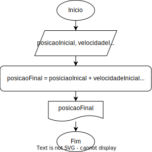

# Trabalho de Tópicos Especiais - 4º TINFEM
#### by Felipe Pierotti, Kaio Felipe, João Marcelo, Murilo Neves e Pedro Aranda
Código em Phyton desenvolvido durante a aula de Tópicos Especiais com o objetivo resolver problemas envolvendo Movimento Retilíneo Uniformemente Variado (MUV), utilizado na Física.

## Variáveis utilizadas:
```py 
 posicaoInicial = 0 
 velocidadeInicial = 10 
 tempo = 5
 aceleracao = 2 
 posicaoFinal = 0
 ```

## Operadores utilizados:
- Operador de soma ( + ) 
- Operador de multiplicação ( * ) 
- Operador de divisão ( / ) 
- Operador de potência ( ^ ) 
- Operador de igualdade ( = ) 

## Fórmula utilizada: 
```py
  posicaoFinal = posicaoInicial + velocidadeInicial * tempo + ((aceleracao * pow(tempo, 2)) / 2);
```

## Fluxograma:


